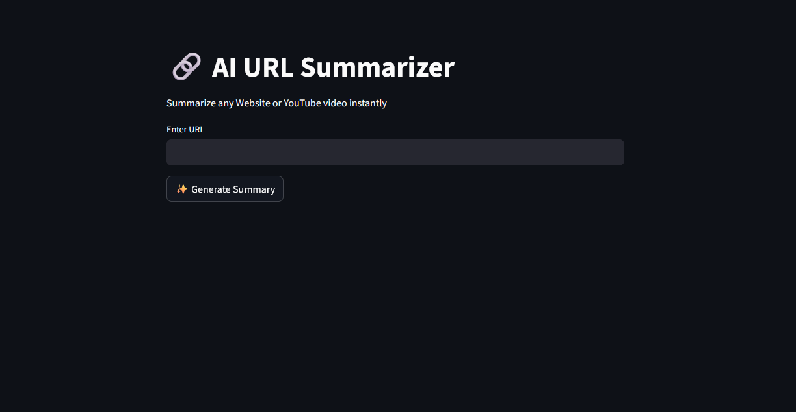

# 🔗 AI URL Summarizer

<p align="center">
  <b>Summarize any Website 🌐 or YouTube 🎥 video using LLMs</b>
</p>

<p align="center">
  <a href="https://urlsummarizer-project3.streamlit.app/">🌍 Live Demo</a>
</p>

<p align="center">
  
  
  
  
</p>

---

## ✨ Features

- 🔗 Summarize any website URL  
- 🎥 YouTube video summarization (via transcripts)  
- ⚡ Fast inference using Groq (LLaMA 3)  
- 🧠 Handles long content using Map-Reduce summarization  
- 🎨 Clean and modern UI built with Streamlit  
- 🔐 Secure API key handling  

---

## 📸 App Preview

### 🏠 Home Interface
<p align="center">
  
</p>

### 📄 Generated Summary
<p align="center">
  
</p>

---

## 🛠️ Tech Stack

- **Frontend:** Streamlit  
- **LLM:** Groq (LLaMA 3)  
- **Framework:** LangChain  
- **Language:** Python  

### 📡 Data Sources
- 🌐 Web scraping (BeautifulSoup)  
- 🎥 YouTube transcripts  

---

## 🚀 Run Locally

```bash
git clone https://github.com/KunalS6/URL_Summarizer.git
cd URL_Summarizer
pip install -r requirements.txt
streamlit run app.py